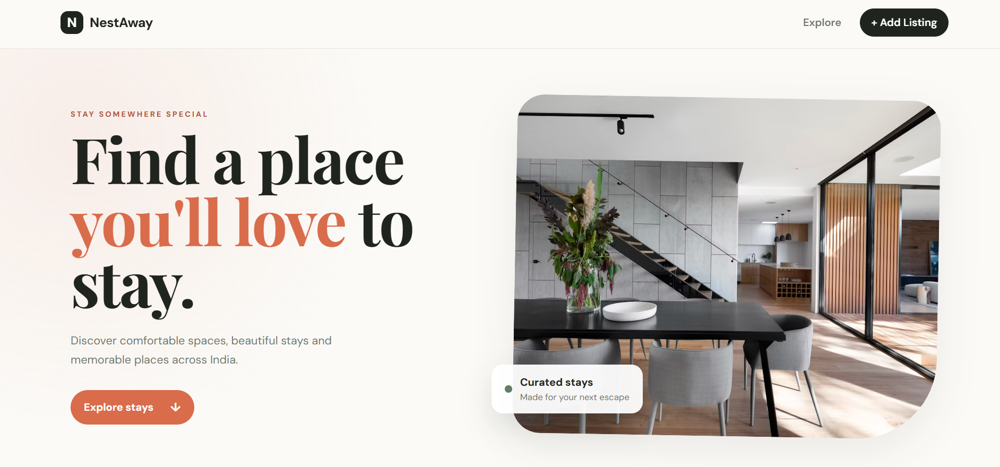
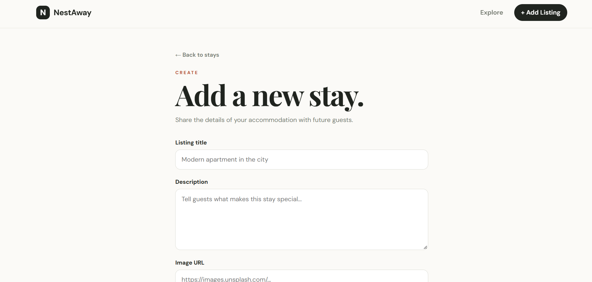

# NestAway — Accommodation Listing Platform

A full-stack accommodation listing application built with Node.js, Express.js, MongoDB, Mongoose and EJS.

## ✨ Features

- View all accommodation listings
- View a single listing
- Create a listing
- Edit a listing
- Delete a listing
- Joi request validation
- Mongoose schema validation
- Centralized Express error handling
- Async error forwarding with `wrapAsync`
- Dynamic EJS templates
- REST-style routes
- Responsive and portfolio-focused UI
- Sample data seeding script
- Invalid MongoDB ObjectId handling
- Custom 404 and error pages

## 🛠️ Tech Stack

### Backend
- Node.js
- Express.js
- Mongoose
- MongoDB

### Frontend
- EJS
- EJS-Mate
- HTML5
- CSS3
- Vanilla JavaScript

### Validation & Utilities
- Joi
- Method Override
- Custom Express Error Handling

## 🏗️ Project Architecture

```text
Browser
   ↓
Express Route
   ↓
Joi Validation
   ↓
Mongoose
   ↓
MongoDB
   ↓
Mongoose Result
   ↓
EJS Template
   ↓
HTML Response
   ↓
Browser

```

## 📁 Project Structure

```text

NestAway/
├── app.js
├── package.json
├── .env.example
├── .gitignore
├── initData.js
├── README.md
├── schema.js
├── middleware/
│   └── validateListing.js
├── models/
│   └── listing.js
├── routes/
│   └── listing.js
├── utils/
│   ├── ExpressError.js
│   └── wrapAsync.js
├── public/
│   ├── css/
│   │   └── style.css
│   └── js/
│       └── script.js
└── views/
    ├── layouts/
    │   └── boilerplate.ejs
    ├── listings/
    │   ├── index.ejs
    │   ├── show.ejs
    │   ├── new.ejs
    │   └── edit.ejs
    └── error.ejs

```
## 🖼️ Screenshots

### Home Page



### Listings


### Add New Listing


